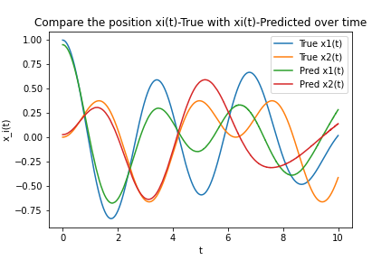

# Physics-Informed ML: solving an ODE with Two Spring-Coupled Masses

This notebook is an introduction to Physics-Informed Machine Learning

In what follows we will try to solve the ODE of the classical problem of *Two Spring-Coupled Masses*, using [Nvidia Modulus library](https://docs.nvidia.com/deeplearning/modulus/getting-started/index.html)

Motion Analytic equation of

$E(1):  m_1\,\ddot{x}_1$	$\displaystyle = -k_1\,x_1 +k_2\,(x_2-x_1)	$

$E(2):  m_2\,\ddot{x}_2$	$\displaystyle = -k_2\,(x_2-x_1) +k_3\,(-x_2) $

 

To solve this problem, we will use the following steps:
- Define the ODE of the problem
- Define the geometry of the problem
- Define the initial conditions
- Define the boundary conditions

After solving the problem, we will compare the results with the analytical solution of the problem.
)

